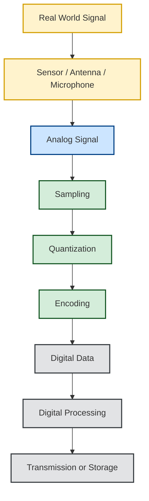

# Module 1: Introduction to Sampling

Imagine you are listening to your favorite song

When a singer performs, their voice is a **continuous sound wave**. It changes smoothly over time.

This type of signal is called an **analog signal**.

Now think about how Spotify, YouTube, or your phone stores that same song. Computers cannot directly store continuous analog signals. Instead, they convert them into numbers. But how can a continuously changing signal become numbers?

The answer is **Sampling**

Sampling is the **first step** in converting real-world analog signals into digital data. Without sampling, there would be no Digital music, Digital cameras, Mobile phones, Internet calls, Digital television etc.,. **Sampling.** is one of the most fundamental concepts in digital signal processing and communication.

---

# Why Do We Need Sampling?

Modern electronic devices are digital. Digital devices understand only 0s and 1s. However, the real world is analog. Human voice, Music, Radio waves, Temperature, Pressure, Light intensity - all of these signals vary continuously. Digital systems cannot directly process continuous signals. Therefore, we first convert them into a digital form. The very first step of this conversion is **Sampling.**

---

# The Digital Revolution

Before digital electronics became common, communication systems were almost entirely analog.

Today, almost every communication system is digital. Although these systems transmit digital information, the original information often starts as an analog signal.

For example,

Without sampling, digital communication would not exist.

---

# What is Sampling?

## Definition

**Sampling is the process of measuring the value of a continuous-time signal at specific intervals of time to produce a discrete-time signal.**

Simply put, instead of recording **every instant** of a signal, we record only selected points. Imagine taking snapshots of a moving object.Instead of recording every possible moment,
you capture

_src: https://www.joecrowtheaudiopro.com/2020/12/01/what-sample-rate-should-you-use-for-home-recording/_

Each dot represents one **sample**. The collection of these samples can later be used to reconstruct the original signal.

One of the best ways to understand **sampling** is by thinking about a **flip book**. A flip book consists of many individual drawings. Each page contains a slightly different picture.
When you quickly flip through the pages, your brain combines these individual pictures into one smooth animation.

source: Tenor

Each page is a **snapshot** of the moving object. These snapshots are called **samples**. The motion you see is created from these individual samples.

---

# Visualizing Sampling

The smooth curve is the original signal. The dots are the sampled values.

Imagine watching a football match. Instead of watching the entire game, someone takes a photograph every second. Each photograph captures the scene at a specific instant. Together,the photographs provide a good representation of the game. Sampling works the same way. Instead of recording every instant, the system records the signal at regular intervals.

src: https://happyphotodad.wordpress.com/2016/02/21/life-at-8-fps/

Sampling allows digital systems to process real-world signals. Once a signal has been sampled, we can store it, compress it, encrypt it, filter it, transmit it, analyze it or even reconstruct it later
Without sampling, modern communication technologies would not be possible.

---

# Everyday Examples of Sampling

## Digital Audio

When recording music, the microphone captures analog sound. The Analog-to-Digital Converter (ADC) samples it thousands of times every second.
For example, Audio CDs use 44,100 samples every second. This is called a 44.1 kHz Sampling Rate

## Video

A movie is actually a sequence of sampled images. For example, 30 frames per second means 30 image samples every second.

---

# The Complete Signal Journey

Almost every modern communication system follows this sequence:

Sampling is the bridge between the analog world and the digital world.

---

# Summary

Sampling is the process of converting a continuous-time signal into a discrete-time signal by measuring its value at regular intervals. It forms the foundation of digital communication and digital signal processing. Every digital communication system begins by sampling the incoming analog signal before any digital processing takes place. Understanding sampling is essential before learning topics such as

- Nyquist Sampling Theorem
- Aliasing
- Quantization
- PCM
- ADCs
- Digital Modulation

These topics will be covered in the following modules.

---
