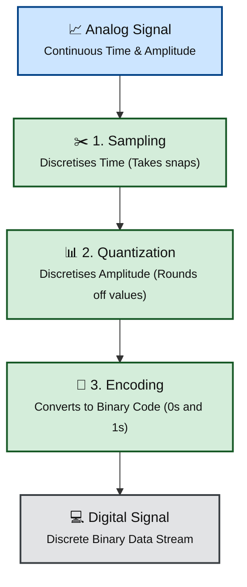

# Module 2: Analog Signals vs Digital Signals

# Introduction

Before learning sampling, modulation, or digital communication, we must first understand one important question - What is a Signal? 

# What is a Signal?

A **signal** is a physical quantity that carries information. It changes with time and represents some meaningful information. A signal can represent anything. For example sound, temperature, light, pressure, voltage, current, radio waves etc.,

In communication systems, signals are usually represented as **voltage varying with time**.

Imagine speaking into a microphone. The microphone converts sound into an electrical signal. That electrical signal now carries your voice.

Another example is a thermometer. Temperature -> Sensor -> Voltage Signal.
Again, the voltage carries information about temperature.

## Common Physical Forms
 * **Acoustic**: Sound waves vibrating through air.
 * **Thermal**: Fluctuating temperatures in a engine.
 * **Optical**: Varying intensity of light in fiber cables.
 * **Electromagnetic**: Radio waves traveling through space.

---

# What is an Analog Signal?

_src: Arduino Documentation_

An analog signal is a continuous-time, continuous-amplitude signal. This means it is defined at every single split second of time, and its value can be any real number within a given range.
 * **Continuous Time**: The signal exists at t = 1.0s, t = 1.0001s, and every infinitely small instant in between. There are no gaps in time.
 * **Continuous Amplitude**: Between any two voltage levels, there are an infinite number of possible values .

---

# Characteristics of Analog Signals

Analog signals

- Are continuous in time.
- Are continuous in amplitude.
- Can have infinitely many values.
- Closely represent natural phenomena.
- Are more susceptible to noise.

---

# Examples of Analog Signals

The real world is mostly analog.

Examples include

- Human speech
- Music
- ECG signals
- EEG signals
- Temperature
- Pressure
- Light intensity
- Radio waves
- Ocean waves

---

# What is a Digital Signal?

A **digital signal** represents information using a **finite number of discrete values**. Most digital systems use only two levels - 0s & 1s. Instead of changing smoothly, the signal jumps between fixed levels.

Notice the sudden transitions. Digital signals do not vary continuously like analog signals.

---

# Characteristics of Digital Signals

Digital signals

- Have discrete levels.
- Are easy to process using computers.
- Are less affected by noise.
- Can be stored accurately.
- Can be copied repeatedly without quality loss.

---

# Examples of Digital Signals

Examples include

- Computer data
- USB communication
- Ethernet
- Wi-Fi packets
- Bluetooth packets
- SSD storage
- Digital television
- Mobile communication
- Binary data

---

# Analog vs Digital Signals

| Feature | Analog | Digital |
|---------|---------|---------|
| Nature | Continuous | Discrete |
| Values | Infinite | Finite |
| Noise Immunity | Low | High |
| Storage | Difficult | Easy |
| Processing | Analog Circuits | Digital Processors |
| Error Detection | Difficult | Easy |
| Copy Quality | Degrades | Nearly Perfect |
| Examples | Voice, Temperature | Computer Data, Internet |

---

# Advantages of Analog Signals

- Naturally represent real-world phenomena.
- No quantization error.
- Simple sensors often produce analog outputs.

---

# Disadvantages of Analog Signals

- Easily affected by noise.
- Difficult to store.
- Difficult to encrypt.
- Difficult to compress.
- Signal quality degrades over long distances.

---

# Advantages of Digital Signals

- High noise immunity.
- Easy to store.
- Easy to process.
- Easy to compress.
- Easy to encrypt.
- Supports error detection and correction.
- Can be transmitted over long distances with repeaters.

---

# Disadvantages of Digital Signals

- Requires Analog-to-Digital Conversion (ADC).
- Introduces quantization error.
- Requires higher processing power.
- Needs proper synchronization.

---

# Why Modern Communication Uses Digital Signals

Almost every modern communication system uses digital signals because they offer

- Better reliability
- Better security
- Better storage
- Better compression
- Better processing
- Better error correction

This is why technologies such as

- Wi-Fi
- Bluetooth
- 4G
- 5G
- Fiber Optics
- Satellite Communication

all rely on digital communication.

---

# The Bridge Between Analog and Digital

Although modern systems process digital information, the real world remains analog. Therefore, every communication system must convert analog signals into digital signals.

This process is

The first step in this conversion is **sampling**, which you learned in Module 1. The next modules will explain how this conversion works in detail.

---

# Summary

- A signal carries information.
- Analog signals change continuously.
- Digital signals use discrete levels.
- The real world is analog.
- Computers work digitally.
- Sampling bridges the gap between analog and digital systems.
