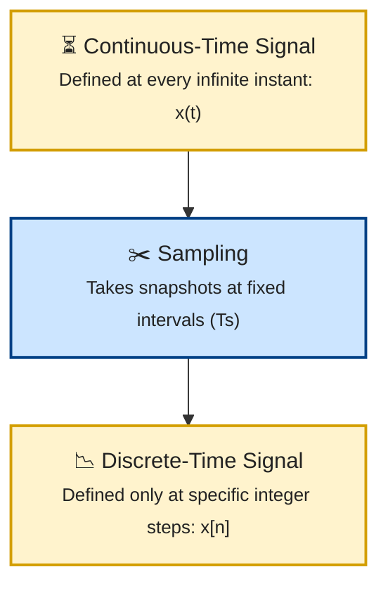
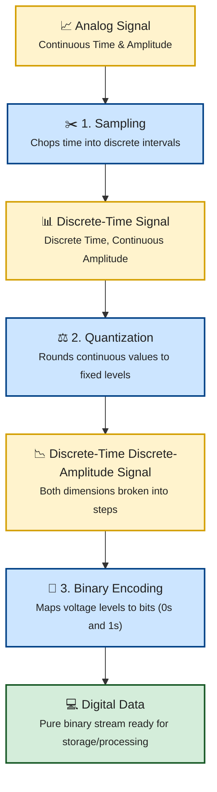

# Module 3: Continuous-Time Signals vs Discrete-Time Signals

Before we learn **sampling**, we must first understand what happens to **time**.

When engineers describe signals, they usually ask two questions:

1. **How does the signal vary with time?**

2. **How does the signal vary in amplitude?**

These two questions give rise to two important classifications:

- Continuous-Time vs Discrete-Time
- Analog vs Digital

Many beginners think these mean the same thing. But they are not the same. Understanding this difference is one of the most important concepts in Digital Signal Processing.

Imagine watching a moving car. The car keeps moving continuously. At every instant, the car has a position. 


You can observe the car

- now
- one microsecond later
- one nanosecond later
- one millisecond later

There is **no gap** in time. This is called **continuous time**.

Now imagine taking a photograph every second. You only know where the car was at those specific moments.


Between two photographs, you have no information. This is called **discrete time**.

---

# Continuous-Time Signals

A **continuous-time signal** exists for **every possible instant of time**. No matter how closely you zoom in, the signal still exists.

Mathematically, it is written as **x(t)**, where t represents continuous time.

---


Notice the smooth curve. Every instant has a value.

---

# Discrete-Time Signals

A **discrete-time signal** exists only at specific time instants. Instead of existing everywhere,

it exists only at

```
t = 0, t = Ts, t = 2Ts, t = 3Ts
```

where Ts is the sampling interval.
The signal is written as x[n], where n is an integer.


Only the dots exist. There is **no signal between two samples**.

A discrete-time signal is usually created by **sampling** a continuous-time signal.



Sampling does **not** immediately make the signal digital. It only makes it **discrete in time**. This is a very important point !

---

# Continuous-Time vs Discrete-Time

| Continuous-Time | Discrete-Time |
|-----------------|---------------|
| Exists at every instant | Exists only at sampled instants |
| Uses x(t) | Uses x[n] |
| Smooth waveform | Collection of samples |
| Produced naturally | Usually obtained by sampling |
| Infinite time points | Countable time points |


> #### Continuous-Time Does NOT Mean Analog
> This is where many students become confused. Continuous-time describes **how time is represented.** Analog describes **how amplitude is represented.** These are different concepts.
> #### Analog Does NOT Mean Continuous-Time
> Likewise, Digital does not necessarily mean discrete-time. There are actually four possible combinations.

| Time | Amplitude | Example |
|-------|-----------|----------|
| Continuous | Continuous | Analog microphone output |
| Discrete | Continuous | Sampled analog signal |
| Discrete | Discrete | ADC output (digital samples) |
| Continuous | Discrete | Digital waveform on a wire |


Notice something interesting. After sampling, the signal becomes Discrete-Time & Continuous-Amplitude
Only after **quantization** does the amplitude become discrete.

---

# The Journey of a Signal

A real communication system works like this.



> #### Important Note
> **Sampling changes Time** & **Quantization changes Amplitude**

---

# Summary

Continuous-time signals exist at every instant. Discrete-time signals exist only at specific sampling instants. Sampling changes a signal from continuous-time to discrete-time. It does **not** immediately make the signal digital.

- Continuous-time signals exist at every instant.
- Discrete-time signals exist only at sampling instants.
- Continuous-time ≠ Analog.
- Discrete-time ≠ Digital.
- Sampling changes the time representation.
- Quantization changes the amplitude representation.
