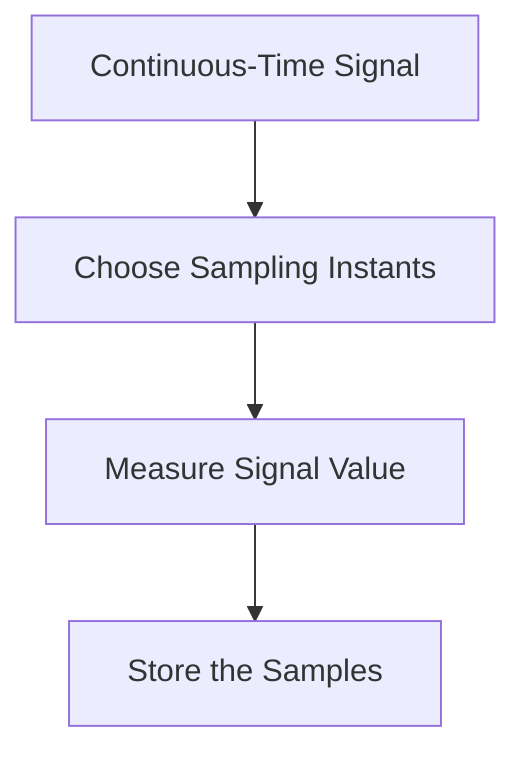
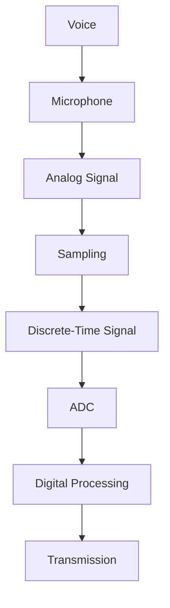

# Module 5: What is Sampling?

## The Sampling Process

The sampling process consists of four simple steps.

The result is a discrete-time signal.

---

## What is a Sample?

A **sample** is one measurement of the signal taken at a specific instant. For example, Suppose the signal values are

| Time | Amplitude |
| :--- | :--- |
| 0 ms | 0.5 V |
| 1 ms | 1.2 V |
| 2 ms | 0.9 V |
| 3 ms | 0.1 V |

Each voltage measurement is one sample.

---

## Sampling Interval

The **Sampling Interval** is the time between two consecutive samples. It is represented by Ts where Ts = Sampling Interval

_src: National Instruments_

---

## Sampling Rate

The **Sampling Rate** tells us how many samples are taken every second. It is represented by Fs, where Fs = Samples per Second. Its unit is Hz
1 Hz = 1 Sample per Second. Suppose we take 1000 samples every second. Then Sampling Rate Fs = 1000 Hz

---

## Relationship Between Sampling Rate and Sampling Interval

Sampling Interval and Sampling Rate are inverses of each other. Sampling Rate Fs = 1 / Ts

where
- **Fs** = Sampling Rate (Hz)
- **Ts** = Sampling Interval (seconds)

#### Example

If Ts = 1 ms , Then Fs = 1 / 0.001 = 1000 Hz

# Sampling in Communication Systems

Every digital communication system begins with sampling.

---

## Summary

Sampling converts a continuous-time signal into a discrete-time signal by measuring its value at regular intervals. Each measurement is called a sample. The time between samples is called the sampling interval. The number of samples taken every second is called the sampling rate. Sampling forms the foundation of digital communication and digital signal processing.

- Sampling converts continuous-time signals into discrete-time signals.
- A sample is one measurement of the signal.
- Sampling Interval = Time between samples.
- Sampling Rate = Samples taken every second.
- Sampling Rate is measured in Hertz (Hz).
- Sampling Interval and Sampling Rate are inverses.
- Every modern digital communication system begins with sampling.
